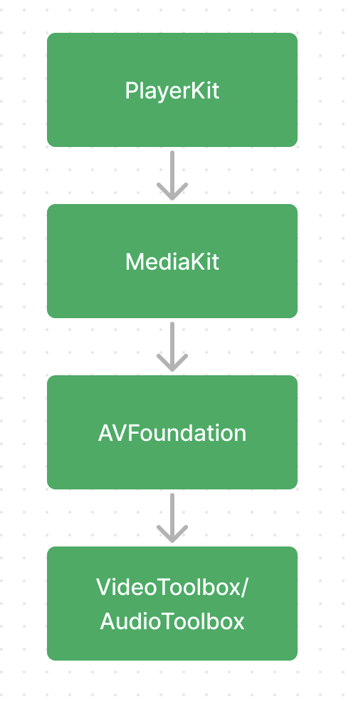

**MediaKit** - toolkit that help easy and fast player development.

**Our Mission** is simple: To help developers, easy and fast develop a player.

We were inspired by the SwiftUI design and want to make player development no more complex than UI screens develop

# 

**MediaKit** a set of video and audio components for player development

**PlayerKit** a set of players based _MediaKit_ components
